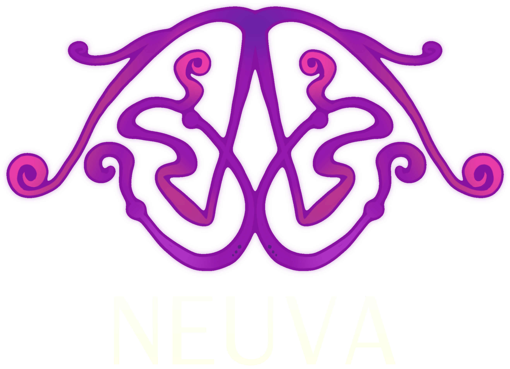

# NEUVA STUDIO — Nemuri: Fragments of Mind

  
  
<strong>Crafting Immersive Psychological & Atmospheric Interactive Experiences</strong>

  
Awarded <em>Krafton Game Union Excellence</em>

---

## ?? Overview

**Neuva Studio** is an indie game studio focused on narrative depth, atmospheric worldbuilding, and psychological exploration. This repository contains the official interactive web experience for our flagship title, **Nemuri: Fragments of Mind**.

### ? Highlights & Interactive Features

- **?? Playable Kael Walker**: Interactive 8-directional animated character controller with responsive physics and directional spritesheets.
- **?? Energeons Interactive Stage**: 3D character inspector and 2D pixel elemental roster featuring *Feanor*, *Keiko*, *Murial*, and *Rona*.
- **?? Brain Expedition Codex**: Subconscious anatomical realms covering the *Amygdala*, *Hippocampus*, and *Pineal Gland* with full lore dossiers and gameplay cutscenes.
- **? Systems Crafting Matrix**: Dynamic mechanic synthesizer showcasing active gameplay loops, dream fragments, and combat interactions.
- **?? Awards & Achievements**: Krafton Game Union Winner spotlight with official trophies and exhibition certificates.
- **?? Studio Collective & Roadmap**: Team directory with personalized skill matrices and upcoming milestone projections.

---

## ??? Tech Stack

- **Framework**: React 18
- **Bundler / Tooling**: Vite
- **Styling**: Tailwind CSS, Custom Animations, Glassmorphism UI
- **Icons**: Lucide React
- **Typography**: Spinnenkop Custom Display Font

---

## ?? Getting Started

### Prerequisites

- Node.js (v18.0.0 or higher recommended)
- npm or yarn

### Installation

`ash
# Clone repository
git clone https://github.com/womiekom/neuva.git

# Navigate into directory
cd neuva

# Install dependencies
npm install

# Start local development server
npm run dev
`

### Production Build

`ash
# Compile and bundle for production
npm run build

# Preview production build locally
npm run preview
`

---

## ?? Project Structure

`	ext
neuva/
+-- public/
¦   +-- assets/
¦   ¦   +-- 3d/           # High-resolution 3D character renders
¦   ¦   +-- achievements/ # Award trophies and certificates
¦   ¦   +-- chapters/     # World realm concept art & presentation slides
¦   ¦   +-- energeons/    # Pixel sprites and elemental splash artwork
¦   ¦   +-- logo/         # Neuva & Nemuri brand identity assets
¦   ¦   +-- nemuri/       # Nocturne world key visuals
¦   ¦   +-- projects/     # Flagship banners and project art
¦   ¦   +-- sprites/      # Kael directional animation frames
¦   ¦   +-- team/         # Team member studio portraits
¦   ¦   +-- videos/       # In-game cutscenes and chapter trailers
¦   +-- fonts/            # Custom display typography
+-- src/
¦   +-- components/       # Modular UI components & interactive stages
¦   +-- data/             # Game lore, chapter dossiers, and metadata
¦   +-- App.jsx           # Main application routing and view switching
¦   +-- main.jsx          # React DOM root entrypoint
¦   +-- index.css         # Global tailwind directives & neon glow themes
+-- docs/                 # Game design documentation and presentation decks
`

---

## ?? License & Copyright

© 2026 Neuva Studio. All rights reserved.
All game assets, artwork, audio-visual materials, and storylines are proprietary property of Neuva Studio.
